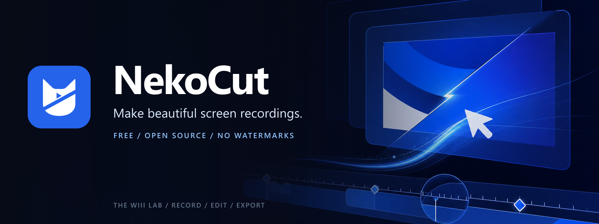

<div align="center">



### Free, open-source screen recording and editing for creators

A creator-focused screen recorder and editor with auto-zoom, silky cursor effects, dynamic webcam overlays, styled backgrounds, annotations, and a drag-and-drop timeline. Built for polished demo videos out of the box.

[](#system-requirements)
[](LICENSE.md)
[](CONTRIBUTING.md)

[Download](#installation) · [Features](#features) · [Build from Source](#build-from-source) · [Website](https://the-wiii-lab.github.io/NekoCut/)

</div>

> See the [NekoCut brand system](branding/BRAND.md) for canonical logos, colors, and usage guidance.

---

## Why NekoCut?

Most screen recorders stop at capture. NekoCut goes further — it records **and** edits in one app, with motion-driven presentation tools that make raw footage look polished without a separate video editor or motion designer.

- **Auto-zoom** follows cursor activity automatically
- **Silky cursor** smoothing, motion blur, click bounce, and sway
- **Dynamic webcam bubble** that scales with zoom
- **Styled frames** with wallpapers, gradients, blur, padding, shadows
- **Timeline editor** for trims, speed regions, annotations, audio layers
- **Extensions marketplace** for community-built add-ons
- **MP4 + GIF export** with quality and format controls
- **Cross-platform**: macOS, Windows, Linux
- **100% free** — no paywalls, no watermarks, no hidden limits

> NekoCut is derived from [Recordly](https://github.com/webadderallorg/Recordly) (AGPLv3). We attribute and thank the original project.

---

## Features

### Recording

- Record full display or single app window
- Capture microphone and system audio simultaneously
- Native capture backends (ScreenCaptureKit on macOS, WGC on Windows)
- Jump straight from recording into the editor
- Resume from saved `.nekocut` project files

### Cursor Polish

- Auto-zoom suggestions based on cursor activity
- Cursor smoothing, motion blur, click bounce, and sway
- Cursor size adjustment
- Loop mode for clean looping GIF exports
- macOS-style cursor assets

### Webcam Overlay

- Dynamic bubble that expands/shrinks with zoom
- Preset positions or custom X/Y placement
- Mirror, roundness, shadow, margin controls
- Zoom-reactive scaling

### Frame Styling

- Built-in wallpapers + custom uploads
- Solid color and gradient backgrounds
- Frame padding, rounded corners, background blur
- Drop shadows
- Aspect ratio presets

### Timeline Editing

- Drag-and-drop timeline
- Trim, split, and rearrange clips
- Manual and automatic zoom regions
- Speed-up and slow-down regions
- Text, image, and figure annotations
- Extra audio regions
- Crop and aspect ratio controls

### Export

- MP4 (standard video)
- GIF (lightweight sharing and loops)
- Quality, frame rate, and size controls
- GIF loop toggle
- Reveal in file manager

### Extensions

NekoCut has a community-driven extension system. Build and publish extensions that add cursor click sounds, device frames, browser mockups, wallpapers, render hooks, settings panels, and more.

---

## Screenshots

<div align="center">

| Recording | Editor | Timeline |
|:---------:|:------:|:--------:|
|  |  |  |

</div>

---

## Installation

### Download a build

Prebuilt releases are available at:

**https://github.com/the-wiii-lab/NekoCut/releases**

### Arch Linux / Manjaro (yay)

```bash
yay -S nekocut-bin
```

### Build from source

#### Prerequisites

| Platform | Requirements |
|----------|-------------|
| **macOS** | Xcode Command Line Tools (`xcode-select --install`) |
| **Linux** | `build-essential cmake libx11-dev libxtst-dev libxrandr-dev libxt-dev` |
| **Windows** | Visual Studio 2022 (or Build Tools) with C++ workload and CMake |

#### Steps

```bash
git clone https://github.com/the-wiii-lab/NekoCut.git
cd NekoCut
npm install
npm run dev
```

For packaged builds:

```bash
npm run build          # all platforms
npm run build:mac      # macOS only
npm run build:win      # Windows only
npm run build:linux    # Linux only
```

### macOS: "App cannot be opened"

Locally built apps may be quarantined. Remove the flag:

```bash
xattr -rd com.apple.quarantine /Applications/NekoCut.app
```

---

## System Requirements

| Platform | Minimum | Notes |
|----------|---------|-------|
| **macOS** | 14.0 (Sonoma) | ScreenCaptureKit requires macOS 14+ for audio capture |
| **Windows** | 10 20H1 (Build 19041) | Native WGC helper requires this build or newer |
| **Linux** | Any modern distro | System audio generally requires PipeWire |

> On Windows builds older than 19041, recording works through fallback capture, but the real OS cursor may remain visible.

---

## How It Works

```
Capture (native)  →  Timeline Editor  →  Scene Render (PixiJS)  →  Export (MP4/GIF)
```

- **Capture layer**: Platform-specific native helpers (ScreenCaptureKit / WGC / Electron)
- **Editor**: Timeline regions define zooms, trims, speed changes, annotations, audio
- **Renderer**: PixiJS composites the final scene with cursor, webcam, and frame styling
- **Export**: Same scene logic rendered to MP4 or GIF
- **Projects**: `.nekocut` files store source media path + editor state

---

## Usage

### Record
1. Launch NekoCut
2. Select a screen or window
3. Choose microphone and system audio options
4. Start recording
5. Stop to open the editor

### Edit
- Add trims, zooms, speed regions, and annotations
- Tune cursor behavior and preview volume
- Style the frame with wallpapers, colors, gradients, blur, padding
- Add or adjust webcam overlay
- Add extra audio regions
- Crop the frame and choose aspect ratio
- Save as `.nekocut` project

### Export
- Choose MP4 or GIF
- Adjust quality, frame rate, size, and loop settings
- Export and reveal in file manager

---

## Limitations

**Cursor hiding** depends on OS support:
- macOS: ScreenCaptureKit excludes the real cursor cleanly
- Windows: Best results require Build 19041+ with native helper
- Linux: Not currently supported (may show both real and styled cursor)

**System audio**:
- Windows: Native WASAPI support
- Linux: Usually requires PipeWire
- macOS: Requires macOS 14.0+ with ScreenCaptureKit

---

## Contributing

Contributions are welcome! Areas where help is especially needed:

- Linux capture and cursor behavior
- Export performance and stability
- UI and UX refinement
- Localization (i18n)
- Additional editor tools

See [CONTRIBUTING.md](CONTRIBUTING.md) for guidelines. Keep PRs focused and test recording/edit/export flows.

---

## Community

- **Bug reports & feature requests**: [Issues](https://github.com/the-wiii-lab/NekoCut/issues)
- **Discussions**: [GitHub Discussions](https://github.com/the-wiii-lab/NekoCut/discussions)
- **Extensions**: [Extension Docs](EXTENSIONS.md)

---

## Tech Stack

| Layer | Technology |
|-------|-----------|
| App shell | Electron 43 |
| UI | React 18 + Radix UI + Tailwind CSS |
| Build | Vite + TypeScript |
| Rendering | PixiJS 8 + pixi-filters |
| Video processing | ffmpeg-static, ffprobe-static |
| macOS capture | Swift (ScreenCaptureKit) |
| Windows capture | C++ (Windows Graphics Capture + WASAPI) |
| GPU compositor | CUDA (NVIDIA) |
| Input hooks | uiohook-napi |
| Testing | Vitest |
| Linting | Biome |

---

## License

NekoCut is licensed under the **[GNU Affero General Public License v3.0](LICENSE.md)**.

NekoCut is derived from [Recordly](https://github.com/webadderallorg/Recordly), which started as a fork of [OpenScreen](https://github.com/siddharthvaddem/openscreen) by Siddharth Vaddem.

---

<div align="center">

**[The Wiii Lab](https://github.com/the-wiii-lab)** · NekoCut is free and open source forever.

</div>
