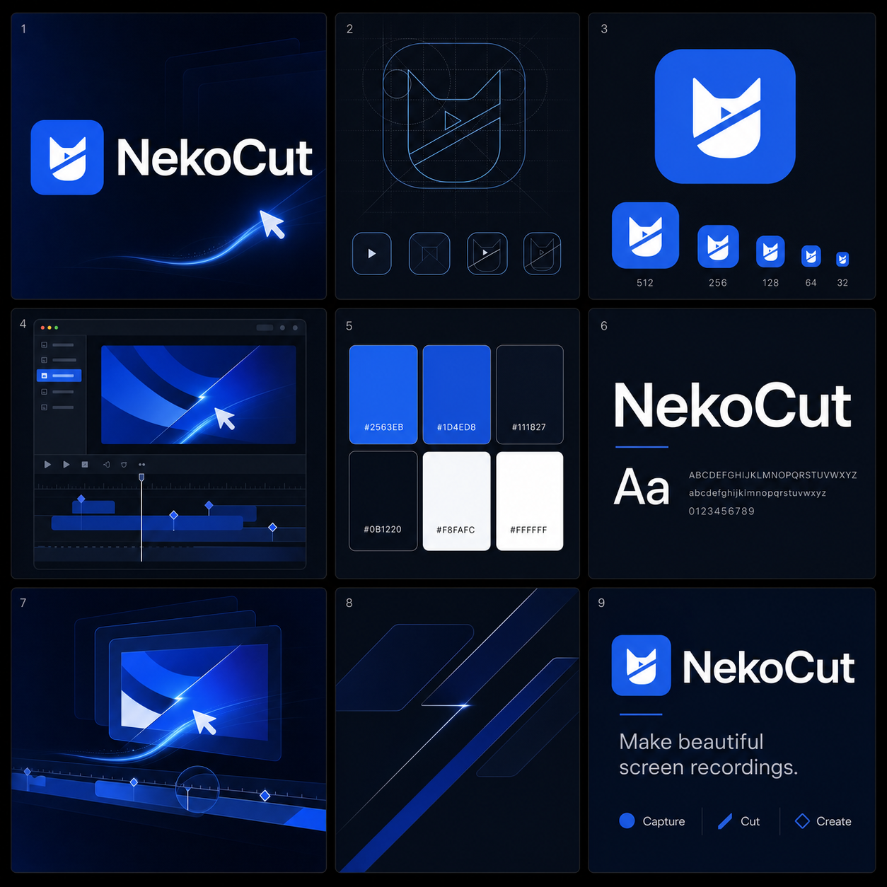

# NekoCut brand system

NekoCut turns raw screen capture into polished motion. Its mark fuses a cat silhouette with the decisive diagonal cut of a timeline edit and a small play-shaped negative space.

## Canonical assets

- `source-assets/NekoCut.svg` — primary square mark and source of truth for exported app icons.
- `source-assets/NekoCut-wordmark.svg` — horizontal logo lockup.
- `source-assets/TheWiiiLab.svg` — parent-organization mark.
- `nekocut-readme-hero.png` — canonical 8:3 repository hero with transparent rounded corners.
- `nekocut-social-preview.png` — 2:1 Open Graph and GitHub social-preview image.

## Palette

| Role | Value |
| --- | --- |
| NekoCut cobalt | `#2563EB` |
| Deep cobalt | `#1D4ED8` |
| Ink | `#111827` |
| Cloud | `#F8FAFC` |
| White | `#FFFFFF` |
| Wiii ivory | `#F2EFE7` |
| Wiii charcoal | `#1D1B18` |

## Usage

- Keep at least 12.5% of the mark width as clear space around the symbol.
- Use the square mark for app icons, favicons, GitHub avatars, and compact UI.
- Use the horizontal lockup only when the name needs to be explicit.
- Keep the diagonal cut and play-shaped negative space intact at every size.
- Use cobalt as the dominant product accent; do not reintroduce the legacy orange cat or Recordly rosette.
- Do not add outlines, extra facial features, scissors, shadows, or additional gradients to the core mark.

## Export sizes

The checked-in icon sets cover 16, 24, 32, 48, 64, 128, 256, 512, and 1024 px where supported. Always regenerate them from `source-assets/NekoCut.svg`; never resize a small raster upward.
